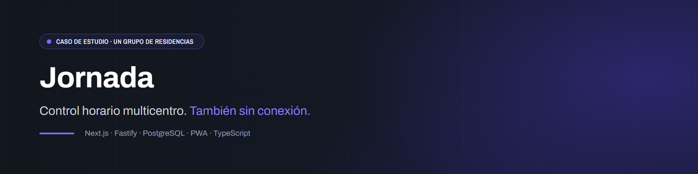
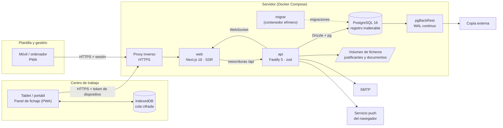

  

# Jornada · control horario multicentro con fichaje sin conexión

        

> [!NOTE]
> **Caso de estudio.** Sistema desarrollado para un grupo de residencias. El código de producción es privado: aquí están el problema, la arquitectura, las decisiones técnicas y [fragmentos de código reescritos](snippets/) para ilustrar las piezas más interesantes.

## El problema

Un grupo de residencias con varios centros abiertos 24/7 necesita registrar la jornada de su plantilla con validez legal. En España el registro horario es obligatorio: debe conservarse cuatro años y estar a disposición de la Inspección de Trabajo. También tiene que gestionar todo lo que rodea al fichaje:

- **Turnos y cuadrantes** por centro y puesto, con rotaciones, turnos partidos y turnos de noche que **cruzan la medianoche**.
- **Cómputo**: horas trabajadas frente a las teóricas, nocturnidad, festivos y tiempo fuera de cuadrante.
- **Bolsa de horas**: saldo, compensaciones, regularizaciones y cierres de periodo.
- **Vacaciones, permisos y ausencias** según convenio, con aprobaciones en cascada por centro y puesto.
- **Cambios de turno** entre compañeras, con aprobación.

La mayoría de la plantilla no trabaja delante de un ordenador. Ficha en una **tablet en la entrada** del centro o en portátiles compartidos, y la conexión a internet de un centro no siempre es fiable. **Si se cae la red, el fichaje no puede pararse.**

Hasta ahora usaban un SaaS comercial de control horario. El objetivo era sustituirlo por un sistema propio, configurable por RRHH y sin dependencias de pago.

## La solución

Una aplicación web instalable (PWA) con tres formas de uso:

| Quién | Dónde | Qué hace |
|---|---|---|
| Personal de atención | Panel del centro (tablet o portátil registrado) | Ficha con **PIN de 6 cifras + un botón**, también **sin conexión** |
| Toda la plantilla | Móvil u ordenador | Consulta su cuadrante y su saldo, y pide vacaciones y cambios de turno |
| Responsables, dirección y RRHH | Ordenador | Montan y publican cuadrantes, aprueban solicitudes, cierran meses y exportan el registro para la Inspección |

Piezas técnicas destacadas:

- **Fichaje offline-first en el panel.** La marca se cifra con la clave pública del servidor y se guarda en una cola de IndexedDB. Se sincroniza al volver la red de forma idempotente, corrigiendo el desfase del reloj de la tablet.
- **Registro inalterable en la propia base de datos.** Triggers que rechazan `UPDATE`, `DELETE` y `TRUNCATE`, más una **cadena de hashes por persona** que calcula PostgreSQL. Las correcciones siempre **añaden**, nunca editan.
- **Motor de cómputo puro.** Funciones sin base de datos ni HTTP que trabajan con intervalos de instantes reales, así que un turno que atraviesa el cambio de hora dura lo que dura de verdad.
- **Avisos en tiempo real** (WebSocket), por correo y **Web Push** con VAPID propio, respetando la **desconexión digital**: fuera de turno solo llega lo urgente.
- **Todo configurable desde la app**: turnos, puestos, patrones de rotación, coberturas mínimas, festivos, tipos de ausencia y políticas de bolsa.

## Arquitectura

- **Monorepo** con `apps/api`, `apps/web` y pruebas de extremo a extremo compartidas.
- La API separa el **dominio puro** (`core/`: tiempo, turnos, cómputo, bolsa, ausencias, permisos, panel) de los **módulos HTTP** (`modulos/`) y los **servicios** (avisos, auditoría, ficheros, PDF y trabajos en cola).
- **Tres roles de base de datos**: un propietario sin login, un migrador que solo usa el contenedor `migrar` y la aplicación, que solo tiene `SELECT` e `INSERT` sobre las tablas del registro.

Más detalle en [docs/arquitectura.md](docs/arquitectura.md).

## Stack

Las versiones salen de los `package.json` y `Dockerfile` del proyecto.

| Capa | Tecnología | Versión |
|---|---|---|
| Runtime | Node.js | 22 |
| Lenguaje | TypeScript (modo estricto en todo el monorepo) | 6.0 |
| Gestor de paquetes | pnpm (workspaces) | 12.5 |
| API | Fastify | 5.12 |
| Validación | zod | 4.6 |
| ORM y migraciones | Drizzle ORM / drizzle-kit, con `pg` | 0.45 / 0.31 |
| Base de datos | PostgreSQL + pgBackRest | 16 |
| Web | Next.js (App Router, `output: standalone`) | 16.3 |
| UI | React, CSS propio con tokens de diseño, iconos Phosphor | 19.3 |
| PWA | Serwist (service worker) | 9.5 |
| Cifrado en el cliente | WebCrypto (RSA-OAEP SHA-256) | nativo |
| Autenticación | argon2id (`@node-rs/argon2`), TOTP 2FA, sesiones opacas | — |
| Tiempo real y avisos | `@fastify/websocket`, `web-push` (VAPID), nodemailer | 11.3 / 3.6 / 10.0 |
| PDF | pdfkit | 0.17 |
| Logs | pino (JSON) | 10.3 |
| Pruebas | Vitest, Playwright, axe-core (WCAG 2.1 AA) | 5.0 / 1.63 / 4.13 |
| Calidad | ESLint, typescript-eslint, Prettier | 10 / 8.70 / 3.9 |
| Contenedores | Docker Compose sobre LXC (Proxmox) | — |

## Decisiones técnicas

El proyecto lleva un **registro de decisiones** (más de 60 entradas, cada una con decisión, porqué y alternativa descartada). Estas son las más relevantes.

### Monorepo TypeScript de punta a punta
Un solo lenguaje para la API, la web y las pruebas. Los esquemas zod y los tipos se comparten entre `api` y `web`, así que un cambio en un contrato rompe la compilación en los dos lados a la vez. Con pnpm workspaces, un solo lockfile y una sola CI.

### Offline-first, pero solo donde hace falta
El **panel del centro** funciona sin conexión. La **cuenta personal no**: si no hay red, el botón lo dice y no guarda nada. Así la excepción queda limitada a dispositivos registrados y controlados por la empresa.

- **La tablet no guarda nada de nadie.** Ni PIN, ni verificadores, ni lista de personas. Al fichar sin red cifra `{pin, uuid}` con la **clave pública del servidor**. Solo el servidor puede abrir ese «sobre», y el uuid dentro del cifrado impide reutilizarlo en otra marca.
- **La sincronización es idempotente.** El uuid que genera la tablet es el identificador definitivo de la marca, así que reenviar la cola nunca duplica.
- **La hora es defendible.** Se guardan la hora del dispositivo, la del servidor y el desfase medido al sincronizar. Computa la hora corregida. Un **contador monótono** detecta colas manipuladas o restauradas.
- **Nunca se pierde un fichaje en silencio.** Lo que no cuadra se guarda como evento rechazado y genera un aviso a la dirección del centro.
- **No hay bloqueo por persona tras PIN erróneos.** La espera se aplica al panel, con backoff exponencial. Así nadie puede dejar a una compañera sin fichar a base de fallos.

→ [snippets/01-cola-sin-conexion.ts](snippets/01-cola-sin-conexion.ts) · [snippets/02-sincronizar-marca.ts](snippets/02-sincronizar-marca.ts)

### Registro inalterable en la base de datos, no en la aplicación
El registro de jornada es un documento legal, así que no basta con que la API «no edite». En PostgreSQL:

- Triggers que rechazan `UPDATE`/`DELETE` fila a fila y `TRUNCATE`. Van con `ENABLE ALWAYS` para que no se los salte `session_replication_role = replica`.
- **Cadena de hashes por persona**, calculada por un trigger `SECURITY DEFINER`, con un *advisory lock* por persona y la zona horaria fijada a UTC (el hash no puede depender de la sesión). Una función `verificar_cadena()` detecta filas alteradas, eslabones rotos y bifurcaciones.
- Un **sello diario** enviado fuera del servidor fija el estado de cada día.
- La aplicación conecta con un rol que **no es dueño de nada**: no puede desactivar triggers ni tocar el esquema.

→ [snippets/03-registro-inalterable.sql](snippets/03-registro-inalterable.sql)

### Drizzle ORM (y SQL a mano donde hace falta)
Drizzle da tipos de TypeScript sobre un SQL explícito y **migraciones legibles**, que se revisan como código. Lo que un ORM no expresa bien (triggers, funciones plpgsql, `NULLS NOT DISTINCT`, permisos por rol) va en SQL comentado dentro de las mismas migraciones. Las migraciones siguen el patrón **«ampliar y después recortar»**, para que volver a la versión anterior siempre funcione.

### El dominio es puro; los datos se calculan, no se graban
- **La jornada pertenece al turno, no al día natural.** La fecha del turno de una marca **se calcula** a partir de las ventanas de turno, no se guarda. La tabla de fichajes solo guarda hechos.
- **La bolsa de horas se calcula** a partir de los días computados. Solo se guardan las decisiones humanas: ajustes, regularizaciones y cierres. Un periodo cerrado no se recalcula, y lo que cambie después entra en el periodo abierto como corrección.
- **Cuadrante versionado.** Nunca se edita un día publicado: se publica una versión nueva y manda la más reciente.
- **Tiempo sobre instantes reales**, con utilidades explícitas de hora local (`Europe/Madrid`) y pruebas obligatorias para los domingos de cambio de hora.

→ [snippets/04-intervalos.ts](snippets/04-intervalos.ts) · [snippets/05-saldo-bolsa.ts](snippets/05-saldo-bolsa.ts)

### CI/CD: imágenes inmutables por etiqueta, con vuelta atrás automática
El diseño original: GitHub Actions pasa lint, tipos, pruebas unitarias, pruebas contra PostgreSQL real y un repaso de navegador. Después construye tres imágenes (`db`, `api` y `web`) y las publica en **GHCR**. En el servidor **no se construye nada**: se despliega una etiqueta con un script que:

1. apunta la versión actual;
2. descarga las imágenes nuevas;
3. aplica las migraciones en un contenedor efímero y, si fallan, no toca nada más;
4. levanta `api` y `web` y espera a que su *healthcheck* esté en verde;
5. si en dos minutos no lo está, **vuelve solo a la etiqueta anterior**.

**Cambio posterior.** Al llenarse el almacenamiento gratuito de Actions, se movió la misma tubería a infraestructura propia. Un script copia el código exacto de la etiqueta (`git archive`) a un contenedor de pruebas, pasa allí la CI completa, construye y ensaya las imágenes y las transfiere a producción con `docker save | docker load`, sin registro. Los flujos de Actions se conservan para lanzarlos a mano.

### Secretos como ficheros
Los secretos se montan como *secrets* de Docker, se generan en el servidor y nunca pasan por variables de entorno ni por el repositorio. La clave del panel se puede **rotar**: mientras quede alguna cola cifrada con la anterior, el servidor prueba las dos.

### La PWA no guarda datos personales en caché
El service worker solo precarga el caparazón, las fuentes y los iconos. **Las respuestas de la API y las páginas no se cachean**, porque casi todo son datos de personas y hay portátiles compartidos. La única excepción es el panel, que no contiene datos de nadie.

### Pruebas en tres niveles
1. **Puras** (Vitest) sobre `core/`, sin base de datos ni red.
2. **Contra PostgreSQL real**: una base temporal que se crea, se migra y se descarta. Nunca contra producción.
3. **Repaso de navegador** con Playwright en todas las rutas, a 390 y 1440 px, en modo claro y oscuro. Detecta errores de consola, desbordes, controles nativos, y **axe-core** hace fallar la prueba si aparece una violación nueva de WCAG 2.1 AA.

Además, un linter propio prohíbe estilos en línea, diálogos nativos (`alert` y `confirm`) y colores sueltos fuera de los tokens.

## Estado actual

- **En producción** desde septiembre de 2026, desplegado por etiquetas de versión.
- **Fases 0 a 5 cerradas**: cimientos, fichaje, turnos, cuadrantes y bolsa, panel sin conexión, ausencias y cambios de turno, gestión, informes y documentos.
- **Fase 6 en curso**: puesta en marcha centro a centro y funcionamiento en paralelo con el sistema anterior antes de darlo de baja.
- **Cifras del repositorio**: 170 commits, 25 migraciones de base de datos y 80 ficheros de prueba.
- **Rendimiento**: en un ensayo con datos sintéticos a escala de la plantilla, las pantallas pesadas (cuadrante mensual, cierre de mes) responden por debajo de 0,4 s. El registro para la Inspección de dos meses tarda menos de 1 s.
- **Pendiente**: validar el fichaje sin conexión en una tablet real del centro, y {{pendiente}} (uso real de la plantilla y fecha de baja del sistema anterior).

## Cómo se construyó

Jornada se desarrolló con **Claude Code** como asistente de programación. La documentación iba primero, el trabajo se hacía por fases cortas y había revisión humana antes de dar nada por cerrado.

**Primero, la documentación.** Antes de escribir código, el repositorio ya tenía:

- un documento maestro con las reglas no negociables del proyecto, que el asistente carga en cada sesión;
- diez documentos de diseño: visión y alcance, arquitectura, modelo de datos, reglas de negocio, panel y PWA, roles y permisos, diseño de interfaz, cumplimiento legal, estrategia de pruebas y despliegue;
- un plan de **siete fases** (de la 0 a la 6), cada una con sus tareas y sus **criterios de aceptación**;
- un **registro de decisiones** que ha llegado a más de 60 entradas, cada una con la decisión, el porqué y la alternativa descartada. Cuando una decisión sustituye a otra, las dos quedan enlazadas.

**Cada fase empezaba igual.** El asistente lee la documentación de la fase, resume en unas líneas lo que va a construir, propone el orden de tareas en pasos pequeños, cada uno con su prueba, y enumera las dudas o datos que faltan. **No se escribe código hasta que yo lo confirmo.**

**Un paso no está hecho hasta que pasan las comprobaciones:**
- lint, que incluye el linter propio de estilos y controles;
- tipos de `api` y `web`;
- pruebas puras y pruebas contra PostgreSQL;
- repaso de navegador;
- formato.

Antes de publicar se repite la CI completa en el entorno de pruebas.

**Revisión humana en cada cierre.** Al cerrar una fase se comprueban los criterios de aceptación, se anotan las decisiones, se etiqueta la versión, se despliega y se revisa con quien corresponda. Las decisiones de producto, de diseño o de infraestructura (por ejemplo, dejar de publicar con GitHub Actions o cambiar los colores de texto por accesibilidad) quedan en el registro con mi aprobación explícita. Parte de la revisión se hace a mano porque detecta cosas que las pruebas no ven. Por ejemplo, un choque de clases CSS que rompía un desplegable del panel lo detecté yo al usarlo, no el repaso automático. De ahí salió una prueba nueva con capturas de ese estado.

**Continuidad entre sesiones.** Un documento de estado recoge dónde está el trabajo, qué hay en producción, qué queda pendiente y las lecciones aprendidas. Así cualquier sesión nueva retoma sin depender de la memoria de la anterior.

## Lo que he aprendido

- **Documentar antes de programar compensa.** Visión, modelo de datos, reglas de negocio y criterios de aceptación por fase se escribieron antes del código. El registro de decisiones evitó volver a discutir lo ya decidido.
- **El tiempo es el dominio más traicionero.** Turnos que cruzan medianoche, cambios de hora y relojes de dispositivo desfasados: trabajar siempre con instantes y convertir a hora local solo en los bordes.
- **La integridad legal va en la base de datos.** Si la garantía depende de que la aplicación «se porte bien», no es una garantía.
- **Offline-first no es «cachear todo».** Se trata de decidir qué dispositivo puede trabajar sin red, qué guarda (lo mínimo) y cómo se reconcilia después.
- **Las pruebas E2E no ven la pantalla.** Una suite en verde puede convivir con una pantalla en blanco, por eso existe el repaso de navegador con capturas.
- **La infraestructura también cambia.** Un límite de almacenamiento en CI obligó a mover la tubería a máquinas propias sin perder las garantías: misma CI, imágenes ensayadas y vuelta atrás automática.
