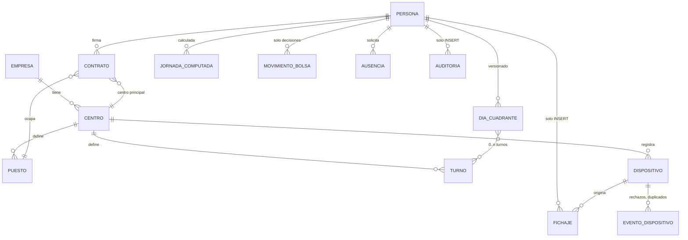
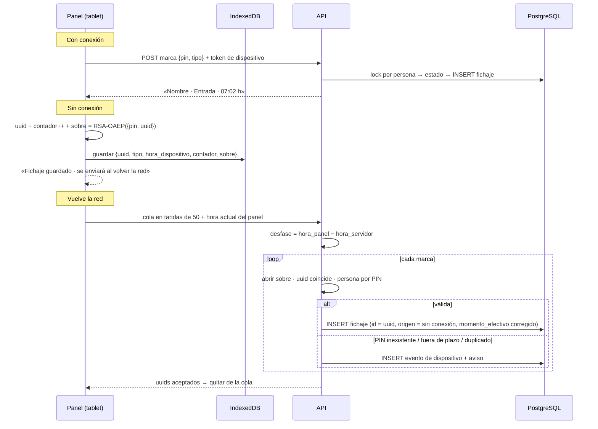
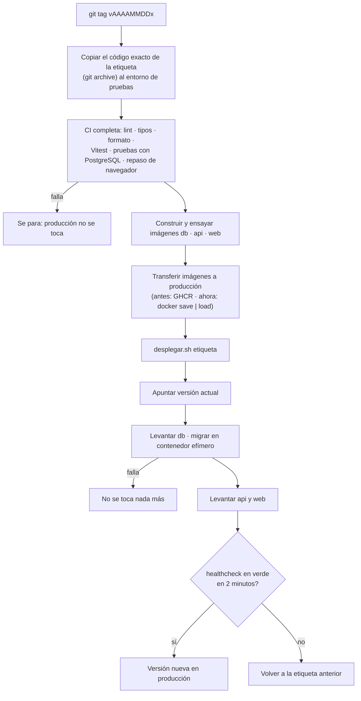

# Arquitectura en detalle

> Caso de estudio. Los nombres de tablas y módulos están simplificados. No hay datos reales.

## 1. Estructura del monorepo

```
jornada/
├── apps/
│   ├── api/
│   │   ├── src/
│   │   │   ├── core/        # dominio puro: sin BD ni HTTP, 100 % probado con Vitest
│   │   │   ├── db/          # esquema Drizzle, cliente, migraciones
│   │   │   ├── http/        # sesión, errores, límites de ritmo, conflictos
│   │   │   ├── modulos/     # rutas por dominio (una carpeta por módulo)
│   │   │   ├── servicios/   # avisos, auditoría, ficheros, PDF, trabajos en cola
│   │   │   └── servidor.ts
│   │   └── drizzle/         # migraciones SQL comentadas (0000 → 0024)
│   └── web/
│       └── src/
│           ├── app/         # App Router: (acceso), (app), (panel)
│           ├── componentes/ # UI propia, sin librería de componentes
│           ├── estilos/     # tokens.css, base.css, componentes.css
│           └── lib/         # cliente de API, cola del panel, utilidades
├── pruebas/                 # repaso de navegador y linter propio
├── docker/                  # Dockerfiles de db (PostgreSQL + pgBackRest), api y web
├── despliegue/              # compose de producción, desplegar.sh, generar-secretos.sh
└── .github/workflows/       # pruebas y publicación de imágenes
```

## 2. Módulos del dominio (`core/`)

Son funciones puras: quien las llama aporta los datos de la base y el reloj del servidor.

| Módulo | Responsabilidad |
|---|---|
| `tiempo` | Conversión entre instantes y hora local (`Europe/Madrid`), fecha de turno, suma de días, cambios de hora |
| `turnos` | Ventanas de turno, asociación de marcas a turnos, patrones semanales, cuadrante efectivo |
| `fichaje` | Máquina de estados (`sin_iniciar → trabajando ⇄ en_pausa → finalizada`), marcas vigentes tras correcciones, avisos |
| `computo` | Aritmética de intervalos, minutos trabajados, teóricos, nocturnos, en festivo y fuera de cuadrante |
| `cuadrante` | Rotaciones, descansos mínimos, cobertura por turno, centro y puesto, cambios de turno |
| `bolsa` | Saldo por periodo (base «cuadrante» o «contrato»), topes, cierre y correcciones de periodos cerrados |
| `ausencias` | Días computados, saldos, prorrateo, arrastre, caducidad y compensación con bolsa |
| `permisos` | Matriz central de permisos por rol y ámbito (centro, puesto) |
| `quiosco` | Reglas del panel: espera por PIN erróneos, doble toque, desfase de reloj, contador monótono, apertura del «sobre» cifrado |
| `acceso` | Códigos de un solo uso, TOTP y verificación del PIN |
| `informes` | Vista «hoy» por centro, cierre de mes, comparación con el sistema anterior |
| `importacion` | Lectura y validación de CSV (personas, contratos, festivos, saldos) |

## 3. Módulos HTTP (`modulos/`)

Cada módulo registra sus rutas dentro de un complemento de Fastify. Así la compresión (br/gzip a partir de 1 KB) y el WebSocket se aplican a todas las rutas. Los módulos principales son: acceso, personas y contratos, fichaje (incluida la cola del panel), correcciones, cuadrante (centro, rotaciones, coberturas), bolsa, ausencias, cambios de turno, quiosco (dispositivos), avisos, documentos, informes, registro para la Inspección (CSV y PDF), importación, puesta en marcha de un centro, auditoría y salud.

## 4. Modelo de datos a alto nivel



Grupos de tablas:

| Grupo | Contenido | Notas |
|---|---|---|
| Organización | Empresas, centros, puestos | El identificador fiscal va por centro |
| Personas | Personas, contratos, credenciales, sesiones, PIN | Sesión opaca guardada con hash. PIN verificado con HMAC y una clave extra solo del servidor («pimienta») |
| Turnos y cuadrante | Turnos, patrones, rotaciones, días de cuadrante versionados, coberturas | Un día de cuadrante tiene de 0 a n turnos y se versiona entero |
| Registro | Fichajes, correcciones, auditoría, sellos diarios | **Inalterable**: triggers y cadena de hashes por persona |
| Cómputo | Jornadas computadas por turno, recálculos pendientes | Se recalcula en cola cuando cambia algo que afecta a muchos días |
| Bolsa | Políticas, periodos, movimientos | El saldo se calcula; solo se guardan las decisiones |
| Ausencias | Tipos (algunos «sensibles»), solicitudes, saldos, justificantes | Nadie ve el tipo de ausencia de un compañero |
| Quiosco | Dispositivos (token guardado con hash), eventos de dispositivo | Los rechazos nunca entran en el registro |
| Transversal | Avisos, preferencias, trabajos, ajustes | — |

### La marca de fichaje

| Campo | Significado |
|---|---|
| `id` | uuid v7. En el panel sin conexión es el uuid que generó la tablet, lo que hace idempotente el reenvío |
| `tipo` | `entrada · inicio_pausa · fin_pausa · salida` |
| `origen` | `web · movil · quiosco · quiosco_sin_conexion · correccion · importado` |
| `momento_servidor` | Cuándo la recibe el servidor (siempre) |
| `momento_dispositivo` | Solo sin conexión: la hora del reloj de la tablet |
| `desfase_ms` | Solo sin conexión: desfase medido al sincronizar |
| `momento_efectivo` | **El instante que computa** |
| `hash_anterior`, `hash` | Eslabones de la cadena por persona |

### Roles de base de datos

| Rol | Quién lo usa | Qué puede hacer |
|---|---|---|
| propietario | Nadie (`NOLOGIN`) | Es dueño de tablas, funciones y triggers |
| migrador | Solo el contenedor `migrar` | Aplica migraciones con `SET ROLE` al propietario y reaplica permisos en cada ejecución |
| aplicación | La API | `SELECT` + `INSERT` en las tablas del registro. No puede desactivar triggers |

La **purga** de registros pasado el plazo legal solo puede hacerse con una función específica, fuera de la aplicación y auditada.

## 5. Flujo del fichaje en el panel



El servidor rechaza las marcas con fecha futura, las de más de siete días y las anteriores al registro del panel. Si llega una secuencia imposible, la marca **se guarda** y el turno queda con una incidencia para revisar.

## 6. Flujo de despliegue



Producción y pruebas viven en **contenedores LXC separados** en un hipervisor Proxmox. Cada uno tiene su propio Docker Compose, con redes interna y de salida separadas. Un proxy inverso termina HTTPS.

### Copias

- **pgBackRest** con archivado continuo de WAL, lo que permite restaurar hasta el último minuto. Además hay una copia horaria fuera del servidor.
- **Sello diario** del registro enviado fuera.
- **Restauración de prueba** periódica con un script que comprueba el número de filas, los sellos y la integridad de las cadenas de hashes.
